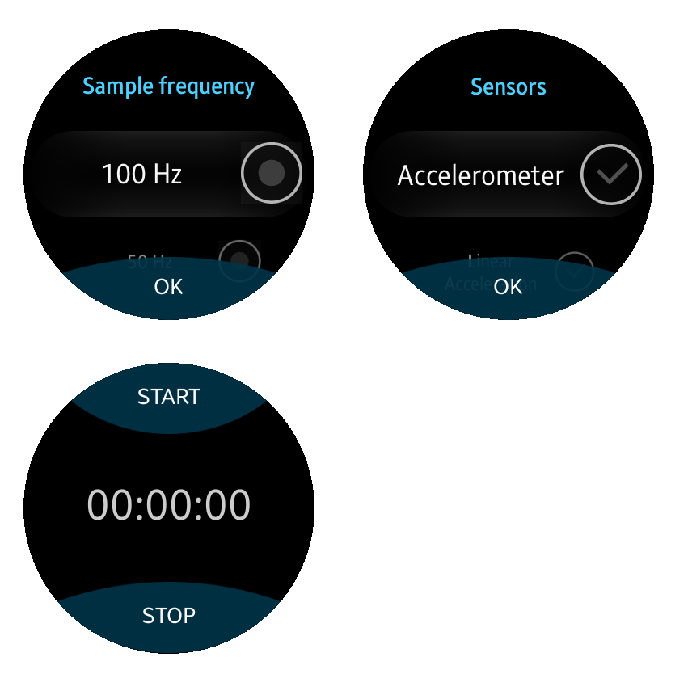

# Tizen Data Capture

Tizen Wearable Tool For Sensor Recording

## Clone

- Clone this repo to your local machine using
- $> git clone https://github.com/bangfutao/tizen-datacapture tizen-datacapture

## How to use
- Open the app to select a sample frequency, and sensors you want to record.
- Press "Start" button to start recording
- Press "Stop" button to stop recording
- Press Back Key to close the app
- The csv files are saved in Downloads folder

   

---
## License

- **[MIT license](http://opensource.org/licenses/mit-license.php)**
